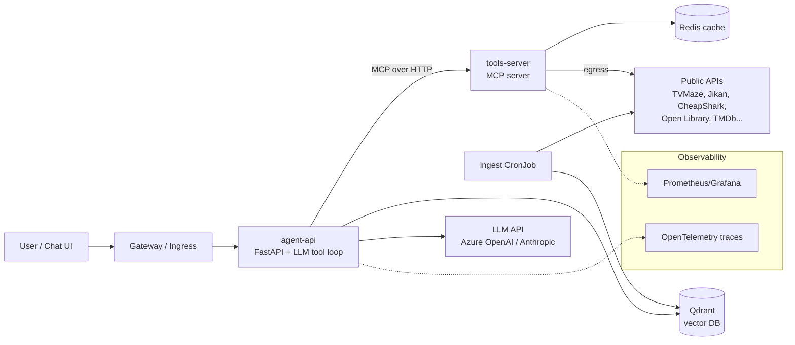

# Project Plan: "Watch Party" — an Entertainment Concierge Agent on Kubernetes

A hands-on learning project for moving from cloud engineering toward AI Engineer / Platform Engineer work.

The agent answers questions like *"I've got 3 hours tonight, I liked Arcane, what should I watch or play?"* To do that it calls free public APIs (TV, anime, games, books, trivia) as tools and searches its own vector index for "something like X" questions. Everything runs on Kubernetes. The project starts on a local cluster, moves through GitOps, and only goes to Azure at the end.

---

## Why this domain works

- **No cloud resources needed.** The data comes from free public APIs, so the agent is useful from day one.
- **Real tool-calling problems.** Each API has its own JSON shape and some have rate limits. Some will be down. Handling that is exactly what agent work looks like in practice.
- **A natural RAG use case.** Questions like "shows like X but darker" are semantic search over show and anime synopses.
- **Infrastructure you actually need.** Outbound egress to external APIs means you'll deal with DNS, NetworkPolicies, caching, and retries for real reasons.
- **Easy to demo.** Anyone can ask it a question in an interview.

---

## End-state architecture



---

## API shortlist

These were picked from the public-apis README (Entertainment, Video, Anime, Games & Comics, and Books sections). Most need no key, which keeps the early phases simple.

| API | Use in the agent | Auth | Notes |
|---|---|---|---|
| **TVMaze** (`api.tvmaze.com`) | Search shows, episodes, schedules | None | Very reliable. Use this for your first tool |
| **Jikan** (`api.jikan.moe`) | Anime search, top anime, synopses | None | Rate limited, so it's a good lesson for the cache layer |
| **CheapShark** (`cheapshark.com/api`) | PC game deals and prices | None | Simple, clean JSON |
| **FreeToGame** (`freetogame.com/api`) | Free-to-play game catalog by genre/platform | None | Good for filter-style parameters |
| **Open Library** (`openlibrary.org`) | Book search, subjects | None | Good alternative domain for the RAG index |
| **Open Trivia DB** (`opentdb.com`) | Trivia questions | None | Fun "quiz me about X" tool |
| **JokeAPI** (`v2.jokeapi.dev`) | Jokes with category filters | None | Trivial. Good first MCP tool |
| **xkcd** (`xkcd.com/info.0.json`) | Comics | None | Trivial |
| **MusicBrainz** | Artist/album lookup | None | Requires a User-Agent header and about 1 request/sec. Good lesson in respecting API rules |
| **TMDb** | Movie data | Free API key | Add in Phase 3 to practice Kubernetes Secrets for a third-party key |

> Many entries in that list are dead, especially anything hosted on `herokuapp.com`, which lost its free tier. Before writing a tool, test the API with `curl`. Every tool should also return a clean error message the LLM can reason about ("service unavailable, try another source") instead of crashing.

---

## Tooling choices

| Concern | Choice | Why |
|---|---|---|
| Local cluster | **kind** | Disposable, cheap, standard in tutorials |
| Language | Python 3.12 + FastAPI | Already your strength |
| LLM | Azure OpenAI (lines up with AI-103) or the Anthropic API | Either works. Keep it behind one small client class so swapping is trivial |
| Agent framework | **Hand-written tool loop first**, LangGraph or Semantic Kernel later | You learn what frameworks hide |
| Tool protocol | MCP (Python MCP SDK, streamable HTTP) | Industry direction, and it gives you a second service to deploy |
| Embeddings | `fastembed` (local, free) or Azure OpenAI embeddings | No cost while learning |
| Vector DB | Qdrant (official Helm chart) | Simple, runs well in a cluster |
| CI | GitHub Actions + GHCR | Public portfolio. The same concepts map 1:1 to Azure DevOps |
| GitOps | Argo CD | Most common in job postings, and the UI helps while learning |
| Ingress | Gateway API (Envoy Gateway or Traefik) | The Kubernetes community is moving from Ingress to Gateway API |
| Observability | kube-prometheus-stack + OpenTelemetry | Standard stack |

---

## Repo layout (monorepo)

```
watch-party/
├── apps/
│   ├── agent-api/          # FastAPI, agent loop, LLM client
│   ├── tools-server/       # MCP server wrapping public APIs
│   └── ingest/             # embedding/ingestion job
├── charts/
│   ├── agent-api/
│   ├── tools-server/
│   └── ingest/
├── gitops/                 # what Argo CD watches (values per env, app-of-apps)
│   ├── apps/
│   └── envs/local/
├── infra/                  # Phase 7 only: small Terraform root module for AKS
├── evals/                  # question set + expected tool calls
├── kind-config.yaml
├── Makefile                # make up / make down / make deploy
└── README.md
```

---

## The phases

Each numbered step is sized for one work session. Check it off when you can show the "done when" result.

### Phase 0 — Kubernetes fundamentals (no AI yet)

**Goal:** be comfortable with the core objects before mixing in agent complexity.

- [x] Install Docker, kind, kubectl, helm, and k9s (k9s is optional but very helpful)
  - Docker 29.1.3, kind 0.31.0, kubectl v1.35.0, helm v4.0.4 were already installed. Installed k9s v0.51.0 via `brew install derailed/k9s/k9s`.
- [x] `kind create cluster --config kind-config.yaml`. Then delete it and recreate it to get used to the cluster being disposable
  - Created `kind-config.yaml` at repo root: single control-plane node, cluster name `watch-party`.
  - Gotcha: Docker Desktop must be running (the app, not just the CLI) before `kind create cluster` — first attempt failed with "Cannot connect to the Docker daemon ... Is the docker daemon running?" because the Desktop app wasn't open. Opened Docker Desktop, then the create succeeded.
  - `kubectl cluster-info` showed the API server and CoreDNS reachable at a `127.0.0.1:<random-port>` URL — kind runs the whole single-node cluster inside one Docker container and exposes that container's API server port to the host; this is written into `~/.kube/config` under context `kind-watch-party`, which is why bare `kubectl` commands work without `--context`. CoreDNS is the cluster's internal DNS, used later for service-to-service name resolution (Phase 3).
  - `kubectl get nodes` showed one `Ready` node `watch-party-control-plane`.
  - Deleted with `kind delete cluster --name watch-party`; confirmed gone when `kubectl get nodes` errored with "connection refused" on `localhost:8080` (kubeconfig had no valid current context left, falling back to the old default address). Recreated with the same `kind create cluster --config kind-config.yaml` and confirmed `Ready` node again.
- [x] Write a tiny FastAPI app with `/healthz` and `/hello`, then containerize it
  - Created `apps/hello/` with `main.py` (two routes: `/healthz` → `{"status":"ok"}`, `/hello` → greeting message), `requirements.txt` (`fastapi`, `uvicorn[standard]`), and a simple single-stage `Dockerfile` (`python:3.12-slim`, copies requirements first for layer caching, `CMD uvicorn main:app --host 0.0.0.0 --port 8000`). Multi-stage/non-root hardening deferred to Phase 2 per the plan.
  - Verified locally first with a venv (`uvicorn main:app --reload`, default bind `127.0.0.1:8000`) and `curl localhost:8000/healthz` / `/hello` — both returned correctly.
  - Built the image (`docker build -t hello:v1 .`) and ran it (`docker run -p 8080:8000 hello:v1`). Confirmed `curl localhost:8080/healthz` and `/hello` both work, while `curl localhost:8000/...` and `curl 0.0.0.0:8000/...` correctly fail — port 8000 only exists inside the container's own network namespace; `-p 8080:8000` is the one forwarding rule that tunnels traffic from the host's 8080 into the container's 8000, and that's the only path in.
  - Key lesson: `--host 0.0.0.0` in the Dockerfile CMD is required so uvicorn listens on all interfaces inside the container (not just the container's own loopback), which is what allows Docker's port mapping (and later, Kubernetes Services) to route traffic in at all. The uvicorn startup log (`Uvicorn running on http://0.0.0.0:8000`) only reports what the process bound to inside its own namespace — it says nothing about whether/how anything outside the container can reach it; that forwarding is a separate concern (Docker `-p`, or later a K8s Service) layered on top.
- [x] Load the image into kind (`kind load docker-image`) and deploy with **raw YAML**: Deployment, Service, ConfigMap (greeting text), Secret (fake key)
  - Created `apps/hello/k8s/{configmap,secret,deployment,service}.yaml`. ConfigMap holds `GREETING`; Secret (`stringData`) holds a fake `FAKE_API_KEY`; Deployment (1 replica, `image: hello:v1`, `imagePullPolicy: IfNotPresent`) injects both as env vars via `configMapKeyRef`/`secretKeyRef`; Service is `ClusterIP` mapping `port: 80` → `targetPort: 8000`.
  - `kind load docker-image hello:v1 --name watch-party` was required before `kubectl apply` — kind nodes run their own isolated container runtime and don't automatically see images built in Docker Desktop; without loading, the pod would fail to pull `hello:v1` (no registry configured).
  - `kubectl apply -f k8s/` created all 4 objects; `kubectl get pods` showed `1/1 Running`.
  - `ClusterIP` (the default Service type) only gives an address reachable *from inside* the cluster — `EXTERNAL-IP` was `<none>` by design, which is why `kubectl port-forward` was needed to reach it from the Mac at all for this bullet.
  - Verified env injection with `kubectl exec <pod> -- env | grep ...` (note: `-it` + piping to `grep` triggers a kubectl TTY-handling crash/panic — drop `-it` when not running an interactive shell).
  - `kubectl port-forward svc/hello 8080:80` logged `Forwarding from 127.0.0.1:8080 -> 8000` — port-forward resolves the Service's `targetPort` and connects straight to the pod, bypassing the Service's own `port: 80` proxy (that proxying only matters for in-cluster traffic).
  - Added a `/test_config` route reading `os.getenv('GREETING')` to prove the ConfigMap was actually wired through. Confirmed the local dev loop needed to pick up code changes with no registry/volume mount in play: rebuild image (`docker build`) → reload into kind (`kind load docker-image`) → `kubectl rollout restart deployment/hello` (needed because the image tag doesn't change, so Kubernetes has no other signal to replace the running pod) → re-run `port-forward` against the new pod. `curl localhost:1333/test_config` returned `{"message":"This is from the ConfigMap: Hello from the ConfigMap!"}`, confirming the full ConfigMap → Deployment → container → app chain.
- [ ] Break it on purpose: a wrong image tag, a crashing app, a bad port. Debug with `kubectl describe`, `logs`, `get events`
- [ ] Add liveness and readiness probes and resource requests/limits
- [ ] Convert the YAML into a Helm chart with `values.yaml`. Deploy with `helm install`, change a value, then `helm upgrade` and `helm rollback`

**Concepts:** pods, deployments, ReplicaSets, services, labels/selectors, probes, ConfigMaps vs Secrets, Helm templating.
**Done when:** `helm install hello ./charts/hello` works and `kubectl port-forward` reaches it.

### Phase 1 — Agent v1, running locally in plain Python

**Goal:** understand tool calling from first principles. No Kubernetes in this phase.

- [ ] Build an LLM client wrapper. One class with `chat(messages, tools)`
- [ ] Write 3 tools as plain Python functions with JSON schemas: `search_tv_shows` (TVMaze), `find_game_deals` (CheapShark), `search_books` (Open Library)
- [ ] Hand-write the agent loop: send a message, run any tool calls the LLM requests, feed the results back, and repeat until a final answer or `max_steps`
- [ ] Trim API responses before returning them to the LLM, keeping only the fields it needs. This is a big lesson in token cost
- [ ] Log every step: the tool name, arguments, latency, and tokens used
- [ ] Create `evals/questions.yaml` with 10 questions and the tool(s) you expect each to use. Write a small script that runs them and reports pass/fail

**Concepts:** tool schemas, the agent loop, context management, failure handling, basic evals.
**Done when:** `python -m agent "find me a cheap co-op game and a show to watch after"` uses 2 tools correctly, and the eval script runs.

### Phase 2 — Containerize the agent and run it in the cluster

**Goal:** your agent is a real Kubernetes workload.

- [ ] Wrap the agent in FastAPI: `POST /chat`, `GET /healthz`
- [ ] Use a multi-stage Dockerfile with a slim base image, running as non-root
- [ ] Write the Helm chart: Deployment, Service, a ConfigMap for the model name and max steps, and a Secret for the LLM API key, created with `kubectl create secret` and **never committed**
- [ ] Deploy to kind and call it via port-forward
- [ ] Scale to 3 replicas and watch requests spread across them in the logs

**Concepts:** 12-factor config, secret handling, stateless services, scaling.
**Done when:** `curl localhost:8080/chat -d '{"message":"..."}'` returns an answer from inside the cluster.

### Phase 3 — Split tools into an MCP server (microservices + cluster DNS)

**Goal:** two services that talk over the cluster network, plus a real agent protocol.

- [ ] Move the tools into `tools-server` as an MCP server using the Python MCP SDK over streamable HTTP
- [ ] Add more tools: Jikan anime, FreeToGame, Open Trivia, JokeAPI
- [ ] Add TMDb with a free API key. It goes in a second Secret that only `tools-server` mounts, which is least-privilege at the pod level
- [ ] Have `agent-api` discover tools from the MCP server at startup, reached at `http://tools-server.watch-party.svc.cluster.local`
- [ ] Debug DNS deliberately: `kubectl run -it debug --image=busybox -- nslookup tools-server`. Then look at how CoreDNS resolves both internal names and external ones like `api.tvmaze.com`
- [ ] Add timeouts, retries with backoff, and clean error messages to every tool

**Concepts:** service discovery, cluster DNS, MCP, separation of concerns, per-service secrets.
**Done when:** you can add a new tool by changing only `tools-server`, and the agent picks it up after a redeploy.

### Phase 4 — RAG: a vector index of shows, anime, and books

**Goal:** handle "something like X" questions that keyword APIs can't answer.

- [ ] Install Qdrant via its Helm chart. Look at the StatefulSet and PersistentVolumeClaim it creates
- [ ] Write an `ingest` job that pulls a few thousand TVMaze shows (paginated `/shows` endpoint), top anime from Jikan, and a few Open Library subjects. It cleans and chunks the synopses, embeds them with `fastembed`, and upserts them with metadata (genre, year, rating, source)
- [ ] Run it first as a Kubernetes **Job**, then as a weekly **CronJob**
- [ ] Add a `semantic_search` tool to the agent with metadata filters, e.g. `type=anime`, `year>2015`
- [ ] Extend the evals with 5 "similar to X" questions
- [ ] Delete the Qdrant pod and confirm the data survives through the PVC

**Concepts:** embeddings, chunking, metadata filtering, hybrid answers (RAG + live APIs), StatefulSets, PVCs, Jobs/CronJobs.
**Done when:** "anime like Cowboy Bebop but newer" returns sensible results that came from the vector index.

### Phase 5 — CI/CD + GitOps (still local)

**Goal:** stop running `helm install` by hand. Git becomes the source of truth.

- [ ] GitHub Actions on push: lint, unit tests, build images, scan with Trivy, push to GHCR tagged with the commit SHA
- [ ] Install Argo CD in kind. Create an app-of-apps in `gitops/` that deploys all three charts plus Qdrant
- [ ] Have CI open a commit (or PR) that bumps the image tag in `gitops/envs/local/`. Argo CD then syncs the change
- [ ] Add the eval script as a CI step that fails the build if pass rate drops below a threshold
- [ ] Practice drift: `kubectl edit` a deployment by hand and watch Argo revert it
- [ ] Practice rollback by reverting the Git commit

**Concepts:** push vs pull deployment, declarative state, drift detection, evals as a quality gate.
**Done when:** a merged PR changes what's running in the cluster without you touching kubectl.

**Azure DevOps note:** the same pipeline in Azure DevOps YAML would be a strong side exercise, since it maps directly to your day job.

### Phase 6 — Make it production-shaped

**Goal:** the platform-engineering layer that most portfolios skip.

- [ ] **Traffic:** install a Gateway API implementation (Envoy Gateway or Traefik) and route `watch-party.localhost` to `agent-api`
- [ ] **TLS:** install cert-manager and issue a self-signed certificate for the gateway
- [ ] **NetworkPolicies:** recreate the kind cluster with Calico, since kind's default networking doesn't enforce policies. Then set default-deny, and allow agent → tools-server, agent → Qdrant, and tools-server → internet egress on 443 plus DNS on 53. Verify that agent-api *cannot* reach the internet directly
- [ ] **Caching and rate limits:** add Redis, cache API responses in tools-server with TTLs, and add a per-API rate limiter (MusicBrainz is about 1 request/sec)
- [ ] **Metrics:** install kube-prometheus-stack and expose custom metrics: tool calls per API, error rate, LLM tokens, and estimated cost per request
- [ ] **Traces:** add OpenTelemetry to both services so one trace shows the whole chain (user request → LLM call → tool call → external API)
- [ ] **Autoscaling:** add an HPA on agent-api and load test with `hey` or `k6`
- [ ] **Guardrails:** limit max steps and max tokens per request, validate tool inputs, and add a basic prompt-injection check, since API data is untrusted text going into the prompt

**Concepts:** zero-trust networking, egress control, observability for LLM apps, cost visibility, autoscaling, AI security basics.
**Done when:** a Grafana dashboard shows requests, tool usage, and token cost, and a NetworkPolicy test proves isolation.

### Phase 7 — Move to Azure (keep the Terraform small)

**Goal:** the same platform in the cloud, using skills you already have. This is one root module, not a framework.

- [ ] In `infra/`: a single Terraform root module with a resource group, an AKS cluster (one small node pool, autoscale 0–2), and ACR. Use a remote state backend
- [ ] Enable **Workload Identity** and use the **Key Vault CSI driver** so no secrets are stored in the cluster
- [ ] Point CI at ACR, and bootstrap Argo CD on AKS from the same `gitops/` repo, adding an `envs/aks/` overlay
- [ ] Optional: buy a cheap domain, set up an Azure DNS zone, and use **external-dns** plus cert-manager with Let's Encrypt for real HTTPS
- [ ] Optional advanced step, matching your day job: make it a private AKS cluster and reason through how egress to public APIs works (NAT Gateway or a firewall allowlist)
- [ ] `make down` runs `terraform destroy`. **Tear it down after every session**

**Concepts:** managed Kubernetes, workload identity, secret management, DNS automation, cost control.
**Done when:** a public HTTPS URL serves the agent, deployed entirely through Git, and you can destroy and rebuild it in one command.

---

## Stretch ideas (after Phase 7)

- **Multi-agent:** a router agent that delegates to specialists (TV, games, books), first hand-written, then rebuilt in LangGraph to compare
- **Memory:** Postgres-backed user preferences ("I don't like horror")
- **Chat UI:** Chainlit or Streamlit as a fourth service
- **KEDA:** scale the ingest workers from a queue
- **Ops agent:** a read-only Kubernetes tool backed by a scoped ServiceAccount (RBAC), so the agent can answer "why is tools-server restarting?"
- **Model comparison:** run the eval suite against two models and chart quality vs cost

---

## Guardrails for yourself

- **Cost:** kind is free. Set a monthly spending limit on the LLM API. On AKS, scale to zero or destroy after each session.
- **Secrets:** add `.env` and `*secret*.yaml` to `.gitignore` from day one. Optionally add a gitleaks pre-commit hook.
- **Scope:** finish each phase's "done when" before starting the next. A working Phase 3 is worth more than a half-built Phase 6.
- **Write as you go:** keep `docs/decisions.md` with one paragraph per choice ("why MCP", "why Qdrant"). It becomes your interview prep.

---

## What this gives you for interviews

- Built a tool-calling agent from scratch, then put its tools behind an MCP server as a separate microservice
- Built a RAG pipeline with scheduled ingestion, metadata filtering, and an eval suite used as a CI quality gate
- Ran it on Kubernetes with Helm and Argo CD (GitOps), NetworkPolicy egress control, and Gateway API + cert-manager
- Added LLM observability (token and cost metrics, end-to-end OpenTelemetry traces)
- Deployed to AKS with Terraform, Workload Identity, and the Key Vault CSI driver
